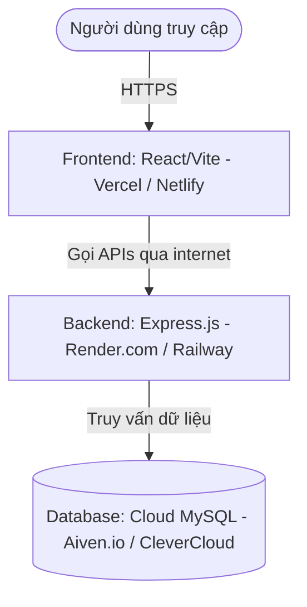

# Hướng Dẫn Triển Khai (Deploy) Dự Án Social Welfare Portal

Chào bạn! Để đưa trang web của bạn lên môi trường chạy thực tế (production) để mọi người có thể truy cập qua internet, chúng ta sẽ cần triển khai cả 3 phần của dự án:
1. **Cơ sở dữ liệu (MySQL)**
2. **Ứng dụng Backend (Node.js/Express)**
3. **Ứng dụng Frontend (React + Vite + TailwindCSS)**

Dưới đây là sơ đồ kiến trúc triển khai thực tế tối ưu và hoàn toàn **miễn phí (Free Tier)**:

---

## 🛠️ Bước 0: Những Cải Tiến Code Đã Thực Hiện
Để chuẩn bị cho việc deploy, tôi đã tối ưu hóa mã nguồn trong phần Frontend để tự động phát hiện và kết nối với URL Backend chạy thực tế thông qua **Biến môi trường (Environment Variables)** thay vì cố định `localhost:3001`:
*   **[AuthContext.tsx](file:///f:/drive_mon_hoc/ie103/DEMO_WEB/frontend/src/contexts/AuthContext.tsx#L16)**: Đã chuyển sang dùng `import.meta.env.VITE_API_URL` linh hoạt.
*   **[DossierPage.tsx](file:///f:/drive_mon_hoc/ie103/DEMO_WEB/frontend/src/pages/Dossier/DossierPage.tsx#L17-L21)**: Đã cập nhật để tự động phân tích `VITE_API_URL` nhằm lấy URL tải biểu mẫu hành chính động khi chạy thực tế.

---

## 🗄️ Bước 1: Triển Khai Cơ Sở Dữ Liệu MySQL Lên Đám Mây
Để Backend chạy trên môi trường cloud có thể kết nối dữ liệu, ta cần một MySQL Server online.

### 🌟 Lựa chọn đề xuất: **Aiven.io** (Miễn phí 100%, có SSL bảo mật)
1. Truy cập [Aiven.io](https://aiven.io/) và đăng ký tài khoản miễn phí.
2. Tạo một Service mới:
   * **Service Type**: Chọn **MySQL**.
   * **Cloud Provider**: Chọn **AWS** hoặc **GCP** (nên chọn khu vực gần Việt Nam như Singapore `ap-southeast-1` để có tốc độ tốt nhất).
   * **Plan**: Chọn **Free tier** (Hạng miễn phí).
3. Đợi khoảng 3-5 phút cho Database khởi tạo xong. Khi hiển thị trạng thái **Running**, bạn hãy sao chép các thông tin kết nối quan trọng:
   * **Host** (e.g., `mysql-xxxx.aivencloud.com`)
   * **Port** (e.g., `12345` hoặc `3306`)
   * **User** (e.g., `avnadmin`)
   * **Password** (Mật khẩu được cấp)
   * **Database Name** (Mặc định là `defaultdb` hoặc tạo cơ sở dữ liệu mới tùy bạn)
4. Sử dụng công cụ quản lý cơ sở dữ liệu trên máy bạn (như DBeaver, Navicat hoặc MySQL Workbench) kết nối tới cơ sở dữ liệu mới này bằng thông tin trên và chạy duy nhất một file SQL gộp:
   * **[init_all.sql](file:///f:/drive_mon_hoc/ie103/DEMO_WEB/code/init_all.sql)** (File này đã được tôi gộp trọn gói gồm: tạo bảng, hàm, view, stored procedure, trigger và dữ liệu mẫu chạy thử theo đúng thứ tự chuẩn). Chỉ cần chạy file này là cơ sở dữ liệu của bạn sẽ sẵn sàng ngay lập tức!

---

## 🚀 Bước 2: Triển Khai Backend Lên Render.com
Render là nền tảng tuyệt vời và cực kỳ dễ dàng để chạy Node.js Backend miễn phí.

### 📋 Các bước thực hiện:
1. Đảm bảo toàn bộ code của bạn đã được đẩy lên **GitHub** (trong repository riêng tư hoặc công khai).
2. Đăng ký/Đăng nhập vào [Render.com](https://render.com/) bằng tài khoản GitHub của bạn.
3. Nhấp vào nút **New +** và chọn **Web Service**.
4. Liên kết với tài khoản GitHub của bạn và chọn Repository chứa dự án này.
5. Cấu hình các thông tin cho Web Service:
   * **Name**: `social-welfare-backend` (hoặc tên tùy thích)
   * **Region**: Chọn khu vực gần Việt Nam (như Singapore hoặc Oregon).
   * **Branch**: `main` (hoặc nhánh chứa code mới nhất của bạn)
   * **Root Directory**: Điền `backend` (vì code backend nằm trong thư mục con `/backend` của Repo).
   * **Runtime**: `Node`
   * **Build Command**: `npm install`
   * **Start Command**: `node server.js`
6. Cuộn xuống phần **Environment Variables** (Biến môi trường) và nhấp **Add Environment Variable** để thêm cấu hình kết nối database Aiven (không nên lưu mật khẩu trực tiếp trong code):
   * `PORT`: `3001` (Render sẽ cấp cổng tự động, nhưng đặt cổng mặc định ở đây cũng được)
   * `DB_HOST`: *(Điền Host từ Aiven)*
   * `DB_PORT`: *(Điền Port từ Aiven)*
   * `DB_USER`: *(Điền User từ Aiven)*
   * `DB_PASSWORD`: *(Điền Password từ Aiven)*
   * `DB_NAME`: *(Điền Database Name từ Aiven, ví dụ: `defaultdb`)*
   * `DB_SSL`: `true` *(Bắt buộc để kết nối an toàn với Aiven)*
   * `JWT_SECRET`: *(Tạo một chuỗi ngẫu nhiên dài để bảo mật JWT token)*
   * `JWT_EXPIRES_IN`: `24h`
7. Nhấn **Deploy Web Service** và đợi Render biên dịch ứng dụng của bạn. Sau khi thành công, Render sẽ cung cấp cho bạn một đường dẫn dạng: `https://social-welfare-backend.onrender.com`.
   > [!IMPORTANT]
   > URL API thực tế của bạn sẽ có hậu tố `/api`. Ví dụ: `https://social-welfare-backend.onrender.com/api`

---

## 💻 Bước 3: Triển Khai Frontend Lên Vercel
Vercel là sự lựa chọn số 1 thế giới để deploy các ứng dụng React + Vite tĩnh, hỗ trợ CDN cực nhanh và miễn phí SSL 100%.

### 📋 Các bước thực hiện:
1. Truy cập [Vercel.com](https://vercel.com/) và đăng nhập bằng GitHub.
2. Nhấp vào **Add New...** -> **Project**.
3. Chọn Repository chứa dự án của bạn từ danh sách.
4. Cấu hình dự án trên Vercel:
   * **Project Name**: `social-welfare-portal`
   * **Framework Preset**: Chọn **Vite** (Vercel sẽ tự động phát hiện).
   * **Root Directory**: Nhấp **Edit** và chọn thư mục `frontend` (vì React code nằm trong thư mục con này).
   * **Build Command**: `npm run build`
   * **Output Directory**: `dist`
5. Mở tab **Environment Variables** và thêm biến môi trường liên kết với API Backend vừa tạo ở **Bước 2**:
   * **Key**: `VITE_API_URL`
   * **Value**: `https://social-welfare-backend.onrender.com/api` *(Thay thế bằng URL Render thực tế của bạn)*
6. Nhấp nút **Deploy**. Chỉ mất khoảng 1 phút là trang web của bạn sẽ hoạt động trực tuyến với một URL chính thức cực kỳ chuyên nghiệp (ví dụ: `https://social-welfare-portal.vercel.app`)!

---

## ⚡ Một Số Lưu Ý Quan Trọng (Tips & Troubleshooting)

> [!NOTE]
> **Hiện tượng Render ngủ đông (Cold Start):**
> Gói miễn phí của Render sẽ tạm dừng (ngủ đông) dịch vụ nếu không có lượt truy cập nào trong 15 phút. Khi có yêu cầu đầu tiên, Backend sẽ mất khoảng 30s - 1 phút để khởi động lại. Đây là hiện tượng bình thường của tài khoản Free. Bạn có thể sử dụng các dịch vụ miễn phí như `cron-job.org` hoặc `UptimeRobot` để ping định kỳ đến URL `/api/health` mỗi 10 phút để giữ cho Backend luôn "thức".

> [!WARNING]
> **Vấn đề Upload Tệp (File Uploads) thực tế:**
> Backend hiện tại lưu tệp đính kèm trong thư mục cục bộ `uploads/`. Trên môi trường Cloud tạm thời như Render Free Tier, các tệp này **sẽ bị mất** mỗi khi server khởi động lại hoặc redeploy (do cơ chế Ephemeral Filesystem). 
> *   *Giải pháp lâu dài đã tích hợp:* Tôi đã viết sẵn logic tích hợp **Cloudinary (Miễn phí 25GB)** trực tiếp vào backend controller. 
> *   *Cách kích hoạt:* Chỉ cần chạy lệnh `npm install cloudinary` trong thư mục `backend`, đăng ký tài khoản miễn phí trên [Cloudinary.com](https://cloudinary.com/) và thêm 3 biến môi trường vào Render:
>     *   `CLOUDINARY_CLOUD_NAME`
>     *   `CLOUDINARY_API_KEY`
>     *   `CLOUDINARY_API_SECRET`
> *   *Tự động fallback:* Nếu không cấu hình 3 biến trên, backend sẽ tự động chuyển sang lưu ở ổ đĩa cục bộ như cũ, đảm bảo hoạt động an toàn mà không bị lỗi.

---

Chúc bạn triển khai dự án thành công tốt đẹp! Nếu bạn có bất kỳ câu hỏi nào trong từng bước thực hiện hoặc cần hỗ trợ cấu hình cụ thể, hãy nhắn cho tôi biết nhé! 🚀
