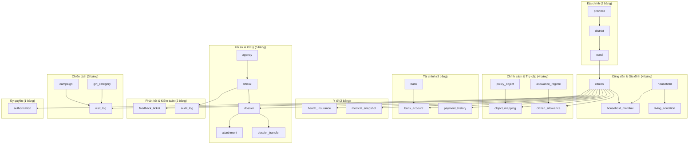
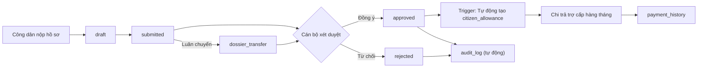
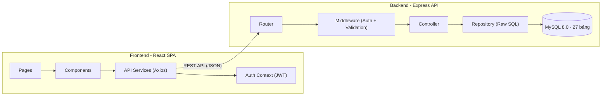

# Cổng Dịch Vụ Công An Sinh Xã Hội - Implementation Plan

---

## 1. Tổng Quan Hệ Thống

Hệ thống **Cổng Dịch Vụ Công An Sinh Xã Hội** là web portal quản lý chính sách xã hội cho người có công với cách mạng Việt Nam, bao gồm:

- **Công dân**: Tra cứu thông tin, nộp hồ sơ, gửi phản ánh kiến nghị, tra cứu tiến độ
- **Cán bộ**: Xét duyệt hồ sơ, quản lý chính sách, chi trả trợ cấp, quà tặng tri ân, giám sát hệ thống

**Database IE103_db bao gồm:**

| Thành phần | Số lượng |
|------------|----------|
| Bảng (Tables) | **27** |
| Trigger | **13** (7 gốc + 6 bổ sung) |
| Stored Procedure | **12** (6 gốc + 6 bổ sung) |
| Function | **12** (6 gốc + 6 bổ sung) |
| View | **14** (8 gốc + 6 bổ sung) |
| Role (Phân quyền) | **6** |

---

## 2. Phân Tích Database Chi Tiết

### 2.1 Danh Sách 27 Bảng

| # | Bảng | Nhóm | Ý nghĩa business |
|---|------|------|-------------------|
| 1 | `province` | Địa chính | Tỉnh/Thành phố |
| 2 | `district` | Địa chính | Quận/Huyện |
| 3 | `ward` | Địa chính | Phường/Xã |
| 4 | `citizen` | Công dân | Thông tin cá nhân, CCCD 12 số |
| 5 | `policy_object` | Chính sách | 7 diện chính sách (Thương binh, Liệt sĩ, CĐHH...) |
| 6 | `object_mapping` | Chính sách | Ánh xạ công dân ↔ diện chính sách |
| 7 | `bank` | Tài chính | Danh mục ngân hàng |
| 8 | `bank_account` | Tài chính | Tài khoản ngân hàng của công dân |
| 9 | `health_insurance` | Y tế | Bảo hiểm y tế ưu đãi |
| 10 | `medical_snapshot` | Y tế | Bệnh án / trạng thái sức khỏe |
| 11 | `household` | Hộ gia đình | Hộ khẩu |
| 12 | `household_member` | Hộ gia đình | Thành viên hộ khẩu |
| 13 | `living_condition` | Hộ gia đình | Đánh giá điều kiện sống |
| 14 | `allowance_regime` | Trợ cấp | 6 chế độ trợ cấp (mức tiền) |
| 15 | `citizen_allowance` | Trợ cấp | Trợ cấp đang hưởng của công dân |
| 16 | `campaign` | Chiến dịch | Chiến dịch thăm hỏi (27/7, Tết...) |
| 17 | `gift_category` | Chiến dịch | Loại quà tặng |
| 18 | `agency` | Cơ quan | Cơ cấu tổ chức 3 cấp (Sở → Quận → Phường) |
| 19 | `official` | Cơ quan | Cán bộ (username, password, role) |
| 20 | `visit_log` | Chiến dịch | Nhật ký phát quà & thăm viếng |
| 21 | `dossier` | Hồ sơ | Hồ sơ yêu cầu (draft → submitted → approved/rejected) |
| 22 | `attachment` | Hồ sơ | Đính kèm hồ sơ |
| 23 | `authorization` | Ủy quyền | Giấy ủy quyền nhận trợ cấp thay |
| 24 | `dossier_transfer` | Hồ sơ | Luân chuyển hồ sơ giữa các cơ quan |
| 25 | `feedback_ticket` | Phản hồi | Phiếu phản ánh kiến nghị từ công dân |
| 26 | `audit_log` | Kiểm toán | Nhật ký thao tác hệ thống |
| 27 | `payment_history` | Tài chính | Lịch sử chi trả trợ cấp |

### 2.2 ERD Logic



### 2.3 Luồng Nghiệp Vụ Chính



### 2.4 Database Review

**Điểm mạnh:**
- Schema đạt 3NF, không dư thừa dữ liệu
- Foreign key + cascade delete/update hợp lý
- CHECK constraints: CCCD 12 ký tự, insurance_code ≥ 10 ký tự
- Indexes trên các cột query thường xuyên
- Trigger bảo vệ business logic chặt chẽ (ngăn sửa hồ sơ đã chốt, validate trợ cấp...)
- Audit logging tự động cho mọi thao tác nhạy cảm
- Phân quyền RBAC 6 role rõ ràng

**Không có lỗi nghiêm trọng.** Một số gợi ý nhỏ đã được xử lý trong code bổ sung:
- `authorization` là reserved word → đã dùng backtick
- `official.password_hash` lưu plain text trong mock → backend sẽ hash bcrypt
- Thiếu auth riêng cho công dân → backend xử lý bằng CCCD + password

---

## 3. Danh Sách Trigger, Procedure, Function, View

### 3.1 Trigger (13 cái)

| # | Tên | Bảng | Thời điểm | Mục đích |
|---|-----|------|-----------|----------|
| 1 | `trg_dossier_check_status` | dossier | BEFORE UPDATE | Ngăn sửa hồ sơ đã chốt (approved/rejected), validate luồng trạng thái |
| 2 | `trg_dossier_audit_status` | dossier | AFTER UPDATE | Ghi audit_log khi thay đổi trạng thái hồ sơ |
| 3 | `tg_dossier_after_approve` | dossier | AFTER UPDATE | Duyệt hồ sơ → tự động tạo citizen_allowance |
| 4 | `trg_allowance_need_policy` | citizen_allowance | BEFORE INSERT | Kiểm tra công dân phải có diện CS active trước khi cấp trợ cấp |
| 5 | `trg_allowance_need_policy_update` | citizen_allowance | BEFORE UPDATE | Kiểm tra khi cập nhật trợ cấp |
| 6 | `trg_policy_expire_suspend_allowance` | object_mapping | AFTER UPDATE | Diện CS hết hạn/tạm dừng → tự động đình chỉ trợ cấp |
| 7 | `tg_audit_citizen_changes` | citizen | AFTER UPDATE | Ghi audit_log khi sửa thông tin nhạy cảm công dân |
| 8 | `trg_visit_check_authorization` | visit_log | BEFORE INSERT | Kiểm tra & cập nhật ủy quyền hết hạn khi phát quà |
| 9 | `trg_authorization_prevent_duplicate` | authorization | BEFORE INSERT | Ngăn tạo ủy quyền trùng lặp, ngăn ủy quyền cho chính mình |
| 10 | `trg_feedback_audit_status` | feedback_ticket | AFTER UPDATE | Ghi audit_log khi cập nhật phiếu PA-KN |
| 11 | `trg_payment_validate_allowance` | payment_history | BEFORE INSERT | Cảnh báo chi trả khi trợ cấp không active |
| 12 | `trg_payment_audit_insert` | payment_history | AFTER INSERT | Ghi audit_log cho mọi giao dịch tài chính |
| 13 | `trg_dossier_auto_timestamp_insert` | dossier | BEFORE INSERT | Auto-set submitted_at, ngăn INSERT trực tiếp approved/rejected |

### 3.2 Stored Procedure (12 cái)

| # | Tên | Mục đích | Dùng cho |
|---|-----|----------|----------|
| 1 | `sp_review_dossier` | Xét duyệt/từ chối hồ sơ (transaction) | Dashboard cán bộ |
| 2 | `sp_add_household_member` | Thêm thành viên vào hộ khẩu | Dashboard cán bộ |
| 3 | `sp_get_campaign_summary_report` | Báo cáo tổng hợp chiến dịch | Dashboard báo cáo |
| 4 | `sp_transfer_dossier` | Luân chuyển hồ sơ giữa cơ quan | Dashboard cán bộ |
| 5 | `sp_resolve_feedback` | Phản hồi xử lý phiếu PA-KN | Dashboard cán bộ |
| 6 | `sp_insert_medical_snapshot` | Ghi nhận bệnh án y tế mới | Dashboard cán bộ |
| 7 | `sp_create_dossier` | Tạo hồ sơ mới (draft/submitted) | Form công dân |
| 8 | `sp_update_citizen_info` | Cập nhật thông tin công dân | Dashboard cán bộ |
| 9 | `sp_create_authorization` | Tạo ủy quyền mới | Dashboard cán bộ |
| 10 | `sp_revoke_authorization` | Thu hồi ủy quyền + ghi audit | Dashboard cán bộ |
| 11 | `sp_get_dashboard_stats` | Thống kê tổng quan (4 result set) | Dashboard tổng quan |
| 12 | `sp_submit_dossier` | Nộp hồ sơ (draft → submitted) | Form công dân |

### 3.3 Function (12 cái)

| # | Tên | Input | Mục đích |
|---|-----|-------|----------|
| 1 | `fn_get_full_address` | ward_id | Ghép địa chỉ: Phường, Quận, Tỉnh |
| 2 | `fn_calculate_age` | dob | Tính tuổi thực tế |
| 3 | `fn_get_total_monthly_allowance` | citizen_id | Tổng mức trợ cấp active (VND) |
| 4 | `fn_count_household_members` | household_id | Đếm nhân khẩu trong hộ |
| 5 | `fn_check_insurance_validity` | citizen_id | Kiểm tra thẻ BHYT hợp lệ (≥70%) |
| 6 | `fn_get_latest_dossier_status` | citizen_id | Trạng thái hồ sơ mới nhất |
| 7 | `fn_count_active_authorizations` | citizen_id | Đếm ủy quyền đang active |
| 8 | `fn_get_monthly_payment_total` | citizen_id, month, year | Tổng chi trả tháng cụ thể |
| 9 | `fn_calculate_allowance_duration` | citizen_id | Thâm niên hưởng trợ cấp (năm/tháng) |
| 10 | `fn_get_citizen_policy_name` | citizen_id | Tên diện chính sách đang active |
| 11 | `fn_has_pending_dossier` | citizen_id | Kiểm tra có hồ sơ đang chờ xử lý |
| 12 | `fn_feedback_resolution_rate` | (không) | Tỷ lệ giải quyết PA-KN (%) |

### 3.4 View (14 cái)

| # | Tên | Mục đích | Dùng cho |
|---|-----|----------|----------|
| 1 | `v_citizen_active_allowance` | Công dân + trợ cấp đang active | Dashboard, tra cứu |
| 2 | `v_household_policy_status` | Hộ gia đình + diện CS + ĐK sống | Tab hộ gia đình |
| 3 | `v_pending_dossiers` | Hồ sơ đang chờ xét duyệt | Tab xét duyệt |
| 4 | `v_active_authorizations` | Ủy quyền đang hiệu lực | Tab ủy quyền |
| 5 | `v_citizen_default_bank` | Tài khoản ngân hàng mặc định | Chi trả |
| 6 | `v_visit_gift_history` | Lịch sử phát quà & thăm viếng | Tab quà tặng |
| 7 | `v_allowance_summary_by_region` | Trợ cấp tổng hợp theo vùng | Báo cáo |
| 8 | `v_policy_object_distribution` | Phân bổ đối tượng CS theo vùng | Báo cáo |
| 9 | `v_dossier_detail` | Hồ sơ chi tiết + cán bộ duyệt + diện CS | Tab xét duyệt |
| 10 | `v_payment_monthly_report` | Báo cáo chi trả theo vùng/tháng | Tab chi trả |
| 11 | `v_feedback_detail` | PA-KN chi tiết + thời gian xử lý | Tab PA-KN |
| 12 | `v_citizen_full_profile` | Profile công dân đầy đủ (1 query) | API tra cứu |
| 13 | `v_authorization_full` | Ủy quyền đầy đủ + status label | Tab ủy quyền |
| 14 | `v_audit_log_detail` | Audit log + tên cán bộ + label | Tab giám sát |

---

## 4. Kiến Trúc Hệ Thống

### 4.1 Technology Stack

| Layer | Công nghệ | Lý do chọn |
|-------|-----------|------------|
| **Frontend** | React 18 + Vite + TypeScript | SPA nhanh, type-safe, ecosystem phong phú |
| **Styling** | TailwindCSS 3 | Responsive nhanh, bám sát Figma dễ dàng |
| **Backend** | Node.js + Express.js | Đơn giản, setup nhanh, phù hợp demo đồ án |
| **Database** | MySQL 8.0+ | Đã có sẵn schema 27 bảng hoàn chỉnh |
| **DB Driver** | mysql2 (raw queries) | Tận dụng tối đa SP/Function/View có sẵn |
| **Auth** | JWT (jsonwebtoken + bcrypt) | Stateless, phù hợp SPA |
| **Validation** | Zod (backend) + React Hook Form (frontend) | Type-safe validation |

**Tại sao dùng raw queries thay vì ORM?**
- Database đã có 13 trigger, 12 SP, 12 function, 14 view → ORM sẽ bypass hoặc xung đột
- Cần gọi trực tiếp `CALL sp_review_dossier(...)`, `SELECT fn_calculate_age(...)`
- Schema cố định, raw query cho performance và kiểm soát tốt hơn

### 4.2 Kiến Trúc Tổng Thể



### 4.3 Cấu Trúc Thư Mục Project

```
DEMO_WEB/
├── plan/                        # Tài liệu kế hoạch
│   └── implementation_plan.md
│
├── code/                        # SQL scripts gốc
│   ├── createTable.sql
│   ├── insertMockData.sql
│   ├── additional_triggers.sql
│   ├── additional_procedures.sql
│   ├── additional_functions.sql
│   └── additional_views.sql
│
├── FIGMA/                       # Figma design PNG
│
├── backend/
│   ├── src/
│   │   ├── config/
│   │   │   └── db.js            # MySQL connection pool
│   │   ├── middleware/
│   │   │   ├── auth.js          # JWT verify + role guard
│   │   │   ├── errorHandler.js  # Global error handler
│   │   │   └── validate.js      # Zod validation middleware
│   │   ├── routes/
│   │   │   ├── auth.routes.js
│   │   │   ├── citizen.routes.js
│   │   │   ├── dossier.routes.js
│   │   │   ├── feedback.routes.js
│   │   │   ├── admin.routes.js
│   │   │   └── lookup.routes.js
│   │   ├── controllers/
│   │   │   ├── auth.controller.js
│   │   │   ├── citizen.controller.js
│   │   │   ├── dossier.controller.js
│   │   │   ├── feedback.controller.js
│   │   │   ├── admin.controller.js
│   │   │   └── lookup.controller.js
│   │   ├── repositories/         # Raw SQL queries
│   │   │   ├── citizen.repo.js
│   │   │   ├── dossier.repo.js
│   │   │   ├── feedback.repo.js
│   │   │   ├── admin.repo.js
│   │   │   └── lookup.repo.js
│   │   ├── utils/
│   │   │   ├── constants.js
│   │   │   └── helpers.js
│   │   └── app.js               # Express setup
│   ├── .env.example
│   ├── package.json
│   └── server.js                # Entry point
│
├── frontend/
│   ├── src/
│   │   ├── components/
│   │   │   ├── layout/          # Header, Sidebar, Footer
│   │   │   ├── common/          # Button, Modal, Table, Pagination, StatusBadge
│   │   │   └── forms/           # Input, Select, DatePicker, FileUpload
│   │   ├── pages/
│   │   │   ├── Home/            # Trang chủ (hero, tiện ích, chiến dịch, FAQ)
│   │   │   ├── Auth/            # Login modal
│   │   │   ├── Dossier/         # Đăng ký hồ sơ (3 tab)
│   │   │   ├── Feedback/        # Phản ánh kiến nghị (3 tab)
│   │   │   ├── Lookup/          # Tra cứu (hồ sơ, đối tượng CS, mức trợ cấp)
│   │   │   └── Admin/           # Dashboard cán bộ (9 module)
│   │   │       ├── DossierMgmt/
│   │   │       ├── PolicyMgmt/
│   │   │       ├── GiftMgmt/
│   │   │       ├── FeedbackMgmt/
│   │   │       ├── HealthMgmt/
│   │   │       ├── HouseholdMgmt/
│   │   │       ├── AuthorizationMgmt/
│   │   │       ├── PaymentMgmt/
│   │   │       └── AuditMgmt/
│   │   ├── contexts/            # AuthContext (JWT)
│   │   ├── services/            # API calls (Axios)
│   │   ├── hooks/               # useAuth, usePagination, useFilter
│   │   ├── types/               # TypeScript interfaces
│   │   └── App.tsx
│   ├── tailwind.config.js
│   ├── index.html
│   └── package.json
│
└── README.md
```

---

## 5. API Design

### 5.1 Authentication

| Method | Endpoint | Mô tả | Role |
|--------|----------|--------|------|
| POST | `/api/auth/login/citizen` | Đăng nhập bằng CCCD + password | Public |
| POST | `/api/auth/login/official` | Đăng nhập cán bộ | Public |
| GET | `/api/auth/me` | Thông tin user hiện tại | All |

### 5.2 Citizen (Công dân)

| Method | Endpoint | Mô tả | SP/Fn/View sử dụng |
|--------|----------|--------|---------------------|
| GET | `/api/citizens/:id` | Thông tin công dân | `v_citizen_full_profile` |
| GET | `/api/citizens/:id/allowances` | Trợ cấp đang hưởng | `v_citizen_active_allowance` |
| GET | `/api/citizens/:id/dossiers` | Danh sách hồ sơ | Direct query |
| GET | `/api/citizens/:id/payments` | Lịch sử chi trả | Direct query |
| GET | `/api/citizens/:id/insurance` | Kiểm tra BHYT | `fn_check_insurance_validity()` |
| GET | `/api/citizens/:id/policy` | Diện chính sách | `fn_get_citizen_policy_name()` |

### 5.3 Dossier (Hồ sơ)

| Method | Endpoint | Mô tả | SP/Fn/View sử dụng |
|--------|----------|--------|---------------------|
| GET | `/api/dossiers` | Danh sách (filter/sort/page) | `v_dossier_detail` |
| GET | `/api/dossiers/pending` | Hồ sơ chờ duyệt | `v_pending_dossiers` |
| POST | `/api/dossiers` | Tạo hồ sơ mới | `sp_create_dossier()` |
| PUT | `/api/dossiers/:id/submit` | Nộp hồ sơ | `sp_submit_dossier()` |
| PUT | `/api/dossiers/:id/review` | Duyệt/Từ chối | `sp_review_dossier()` |
| POST | `/api/dossiers/:id/transfer` | Luân chuyển | `sp_transfer_dossier()` |
| POST | `/api/dossiers/:id/attachments` | Upload đính kèm | Direct INSERT |

### 5.4 Feedback (Phản ánh kiến nghị)

| Method | Endpoint | Mô tả | SP/Fn/View sử dụng |
|--------|----------|--------|---------------------|
| GET | `/api/feedback` | Danh sách (filter/page) | `v_feedback_detail` |
| POST | `/api/feedback` | Gửi phản ánh mới | Direct INSERT |
| PUT | `/api/feedback/:id/resolve` | Phản hồi xử lý | `sp_resolve_feedback()` |

### 5.5 Admin Dashboard (9 module)

| Method | Endpoint | Mô tả | SP/Fn/View sử dụng |
|--------|----------|--------|---------------------|
| GET | `/api/admin/stats` | Thống kê tổng quan | `sp_get_dashboard_stats()` |
| GET | `/api/admin/policy-objects` | Đối tượng CS theo vùng | `v_policy_object_distribution` |
| PUT | `/api/admin/citizens/:id` | Cập nhật công dân | `sp_update_citizen_info()` |
| GET | `/api/admin/campaigns/:id/report` | Báo cáo chiến dịch | `sp_get_campaign_summary_report()` |
| GET | `/api/admin/visits` | Lịch sử quà tặng | `v_visit_gift_history` |
| GET | `/api/admin/health` | BHYT quản lý | Direct query + `fn_check_insurance_validity()` |
| POST | `/api/admin/health/snapshot` | Ghi bệnh án | `sp_insert_medical_snapshot()` |
| GET | `/api/admin/households` | Hộ gia đình | `v_household_policy_status` |
| POST | `/api/admin/households/member` | Thêm nhân khẩu | `sp_add_household_member()` |
| GET | `/api/admin/authorizations` | Ủy quyền | `v_authorization_full` |
| POST | `/api/admin/authorizations` | Tạo ủy quyền | `sp_create_authorization()` |
| PUT | `/api/admin/authorizations/:id/revoke` | Thu hồi | `sp_revoke_authorization()` |
| GET | `/api/admin/payments` | Chi trả | `v_payment_monthly_report` |
| GET | `/api/admin/audit-logs` | Nhật ký hệ thống | `v_audit_log_detail` |
| GET | `/api/admin/allowances-by-region` | Trợ cấp theo vùng | `v_allowance_summary_by_region` |

### 5.6 Lookup (Tra cứu danh mục)

| Method | Endpoint | Mô tả |
|--------|----------|--------|
| GET | `/api/lookup/provinces` | Danh sách tỉnh |
| GET | `/api/lookup/districts/:provinceId` | Quận theo tỉnh |
| GET | `/api/lookup/wards/:districtId` | Phường theo quận |
| GET | `/api/lookup/policy-objects` | Danh sách diện CS |
| GET | `/api/lookup/allowance-regimes` | Mức trợ cấp |
| GET | `/api/lookup/banks` | Danh sách ngân hàng |
| GET | `/api/lookup/campaigns` | Danh sách chiến dịch |

---

## 6. Frontend Pages (Bám Sát Figma)

### 6.1 Trang Công Dân

| Page | Route | Figma | Mô tả chính |
|------|-------|-------|-------------|
| **Trang chủ** | `/` | Trang chủ - Chưa login | Hero banner, search bar, tiện ích phổ biến, chiến dịch, chính sách, FAQ, chatbot |
| **Trang chủ (đã login)** | `/` | Trang chủ - login | Header thay nút "Đăng nhập" bằng icon user + bell + menu |
| **Đăng nhập** | Modal | Login_Modal | CCCD + mật khẩu, QR placeholder, ghi nhớ đăng nhập |
| **Đăng ký hồ sơ** | `/dossier/new` | Form đăng ký hồ sơ | 3 tab: Đăng ký mới / Bổ sung minh chứng / Tải biểu mẫu |
| **Phản ánh & Kiến nghị** | `/feedback` | Form Phản ánh | 3 tab: Gửi yêu cầu / Tra cứu tiến độ / Lịch sử yêu cầu |
| **Tra cứu hồ sơ** | `/lookup/dossier` | — | Tra cứu tiến độ hồ sơ bằng mã HS |
| **Tra cứu đối tượng** | `/lookup/policy` | — | Tra cứu đối tượng chính sách |
| **Hỗ trợ trực tuyến** | Modal | Box_HoTroCoDien | FAQ gợi ý, Hotline, Email, nút gửi kiến nghị/tra cứu |
| **Chatbot** | Float widget | Chatbot | Chat bubble góc phải, hỏi đáp FAQ tự động |

### 6.2 Dashboard Cán Bộ (9 Module)

| Tab | Route | Figma | Nội dung |
|-----|-------|-------|----------|
| **Xét duyệt & Luân chuyển** | `/admin/dossiers` | Report 12 | 4 stat cards + bộ lọc + bảng hồ sơ + pagination |
| **Đối tượng chính sách** | `/admin/policy` | (tương tự 12) | Quản lý diện CS + ánh xạ công dân |
| **Quà tặng & Tri ân** | `/admin/gifts` | Report 13 | Tổng ngân sách, chiến dịch, tỷ lệ phát, bảng phát quà |
| **Xử lý PA & Kiến nghị** | `/admin/feedback` | Report 14 | Tổng phiếu, phiếu chờ, tỷ lệ giải quyết, tốc độ TB |
| **Y tế** | `/admin/health` | Report 15 | Tổng BHYT, yêu cầu cập nhật, bảng BHYT + bệnh án |
| **Hộ gia đình** | `/admin/households` | Report 16 | Tổng hộ, hộ nghèo, nhân khẩu, đánh giá ĐK sống |
| **Giấy ủy quyền** | `/admin/authorizations` | Report 17 | Tổng UQ, active, sắp hết hạn, đã thu hồi |
| **Chi trả** | `/admin/payments` | Report 18 | Tổng ngân sách, giao dịch, tỷ lệ thành công, lỗi |
| **Giám sát** | `/admin/audit` | Report 19 | Cán bộ online, lượt DB, thao tác nhạy cảm, cảnh báo |

### 6.3 Design System (Bám Figma)

| Token | Giá trị |
|-------|---------|
| **Primary color** | Dark red `#6B1D1D` / `#8B2020` |
| **Background** | Cream `#FFF8F0` / `#FDF6EC` |
| **Card background** | White `#FFFFFF` với shadow nhẹ |
| **Stat card header** | Gradient dark red |
| **Status: Đã duyệt** | 🟢 Green `#22C55E` |
| **Status: Chờ duyệt** | 🟡 Yellow `#EAB308` |
| **Status: Từ chối** | 🔴 Red `#EF4444` |
| **Status: Bản nháp** | ⚪ Gray `#9CA3AF` |
| **Button primary** | Dark red background, white text |
| **Font heading** | Serif (Noto Serif Vietnamese) |
| **Font body** | Sans-serif (Inter / Roboto) |
| **Border radius** | 8px cards, 4px inputs |
| **Sidebar** | Left side, cream bg, active = dark red bg |

---

## 7. Tài Khoản Demo

| Vai trò | Username / CCCD | Password | Quyền hạn |
|---------|-----------------|----------|------------|
| Công dân 1 | `079090123456` | `123456` | Tra cứu, nộp hồ sơ, gửi PA |
| Công dân 2 | `010806543210` | `123456` | Tra cứu, nộp hồ sơ, gửi PA |
| Cán bộ phường | `canbophuong` | `123456` | Full dashboard |
| Chuyên viên phòng | `canbophong` | `123456` | Xét duyệt, quản lý |
| Lãnh đạo sở | `lanhdaoso` | `123456` | Toàn quyền |

---

## 8. Hướng Dẫn Setup & Chạy Local

### 8.1 Yêu cầu

- Node.js 18+
- MySQL 8.0+
- npm hoặc yarn

### 8.2 Khởi tạo Database

```bash
# Chạy lần lượt các script SQL
mysql -u root -p < code/createTable.sql
mysql -u root -p IE103_db < code/code_no_comments/trigger\ \(1\).sql
mysql -u root -p IE103_db < code/code_no_comments/HAM.sql
mysql -u root -p IE103_db < code/code_no_comments/thutuc.sql
mysql -u root -p IE103_db < code/code_no_comments/view.sql
mysql -u root -p IE103_db < code/additional_triggers.sql
mysql -u root -p IE103_db < code/additional_functions.sql
mysql -u root -p IE103_db < code/additional_procedures.sql
mysql -u root -p IE103_db < code/additional_views.sql
mysql -u root -p IE103_db < code/insertMockData.sql
mysql -u root -p IE103_db < code/code_demo/Chuong4.sql
```

### 8.3 Chạy Backend

```bash
cd backend
cp .env.example .env    # Sửa DB_HOST, DB_USER, DB_PASSWORD
npm install
npm run dev              # → http://localhost:3001
```

### 8.4 Chạy Frontend

```bash
cd frontend
npm install
npm run dev              # → http://localhost:5173
```

### 8.5 File .env mẫu

```env
# Backend
PORT=3001
DB_HOST=localhost
DB_PORT=3306
DB_USER=root
DB_PASSWORD=your_password
DB_NAME=IE103_db
JWT_SECRET=ie103_jwt_secret_key_2026
JWT_EXPIRES_IN=24h
UPLOAD_DIR=./uploads
```

---

## 9. Verification Plan

### 9.1 Kiểm tra Backend API

```bash
# Health check
curl http://localhost:3001/api/health

# Tra cứu danh mục
curl http://localhost:3001/api/lookup/provinces

# Đăng nhập công dân
curl -X POST http://localhost:3001/api/auth/login/citizen \
  -H "Content-Type: application/json" \
  -d '{"cccd":"079090123456","password":"123456"}'

# Đăng nhập cán bộ
curl -X POST http://localhost:3001/api/auth/login/official \
  -H "Content-Type: application/json" \
  -d '{"username":"canbophuong","password":"123456"}'
```

### 9.2 Kiểm tra Frontend

1. **Trang chủ**: Layout đúng Figma, responsive, hero banner, search bar
2. **Đăng nhập**: Modal popup, CCCD + password, chuyển header sau login
3. **Đăng ký hồ sơ**: Fill form → tạo draft → submit → status chuyển submitted
4. **Dashboard cán bộ**: 9 tab, stat cards, bảng dữ liệu, filter, pagination
5. **Xét duyệt**: Duyệt hồ sơ → trigger ghi audit + tạo allowance
6. **Phản ánh**: Gửi → cán bộ phản hồi → đóng phiếu
7. **Chatbot**: Float widget, FAQ responses

### 9.3 Kiểm tra Database Logic

- Trigger 1-3: Duyệt hồ sơ → auto audit + auto allowance
- Trigger 4-5: Thêm trợ cấp cho người không có diện CS → bị chặn
- Trigger 6: Tạm dừng diện CS → auto suspended allowance
- Trigger 9: Tạo ủy quyền trùng → bị chặn
- Trigger 11-12: Chi trả → auto audit log

---

## 10. Kế Hoạch Triển Khai (Thứ tự)

| Bước | Công việc | Ước lượng |
|------|-----------|-----------|
| 1 | Setup project (Vite + Express + MySQL connection) | — |
| 2 | Backend: Auth (JWT login citizen + official) | — |
| 3 | Backend: Lookup APIs (provinces, districts, wards...) | — |
| 4 | Backend: Citizen APIs + Dossier APIs | — |
| 5 | Backend: Feedback + Admin APIs (tất cả 9 module) | — |
| 6 | Frontend: Layout (Header, Footer, Sidebar) + Design system | — |
| 7 | Frontend: Trang chủ + Login modal | — |
| 8 | Frontend: Form đăng ký hồ sơ + Phản ánh | — |
| 9 | Frontend: Dashboard cán bộ (9 module) | — |
| 10 | Frontend: Tra cứu + Chatbot + Hỗ trợ | — |
| 11 | Polish: Responsive, loading states, error states | — |
| 12 | Test end-to-end + Fix bugs | — |
